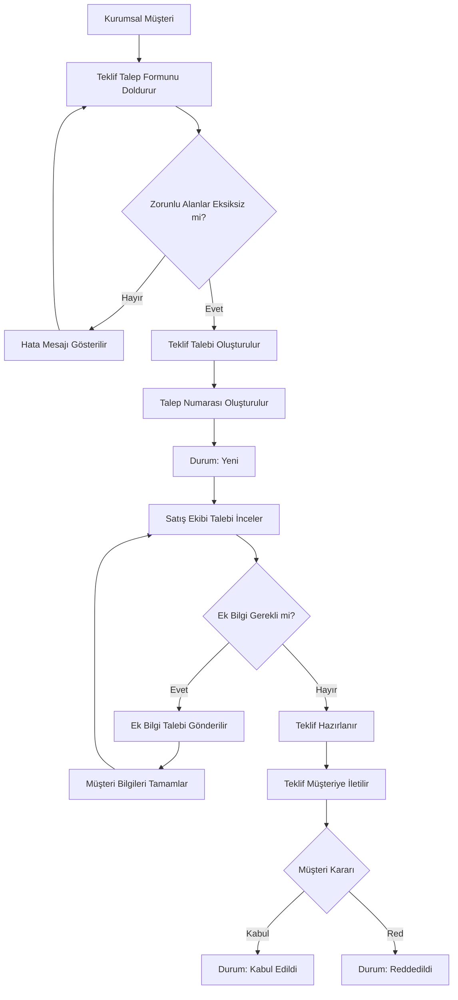

# Süreç Akışı

## B2B Teklif Talep Süreci

Aşağıdaki akış, kurumsal müşterinin teklif talebi oluşturmasından teklifin sonuçlanmasına kadar olan hedef süreci göstermektedir.

## Süreç Adımları

| Adım | Süreç                       | Sorumlu              |
| ---- | --------------------------- | -------------------- |
| 1    | Teklif talebi oluşturma     | Kurumsal Müşteri     |
| 2    | Bilgi doğrulama             | Sistem               |
| 3    | Talep oluşturma             | Sistem               |
| 4    | Talep inceleme              | Satış Ekibi          |
| 5    | Ek bilgi isteme             | Satış Ekibi          |
| 6    | Teklif hazırlama            | Satış Ekibi          |
| 7    | Teklifi müşteriye iletme    | Sistem / Satış Ekibi |
| 8    | Teklifi değerlendirme       | Kurumsal Müşteri     |
| 9    | Teklifi kabul veya reddetme | Kurumsal Müşteri     |
