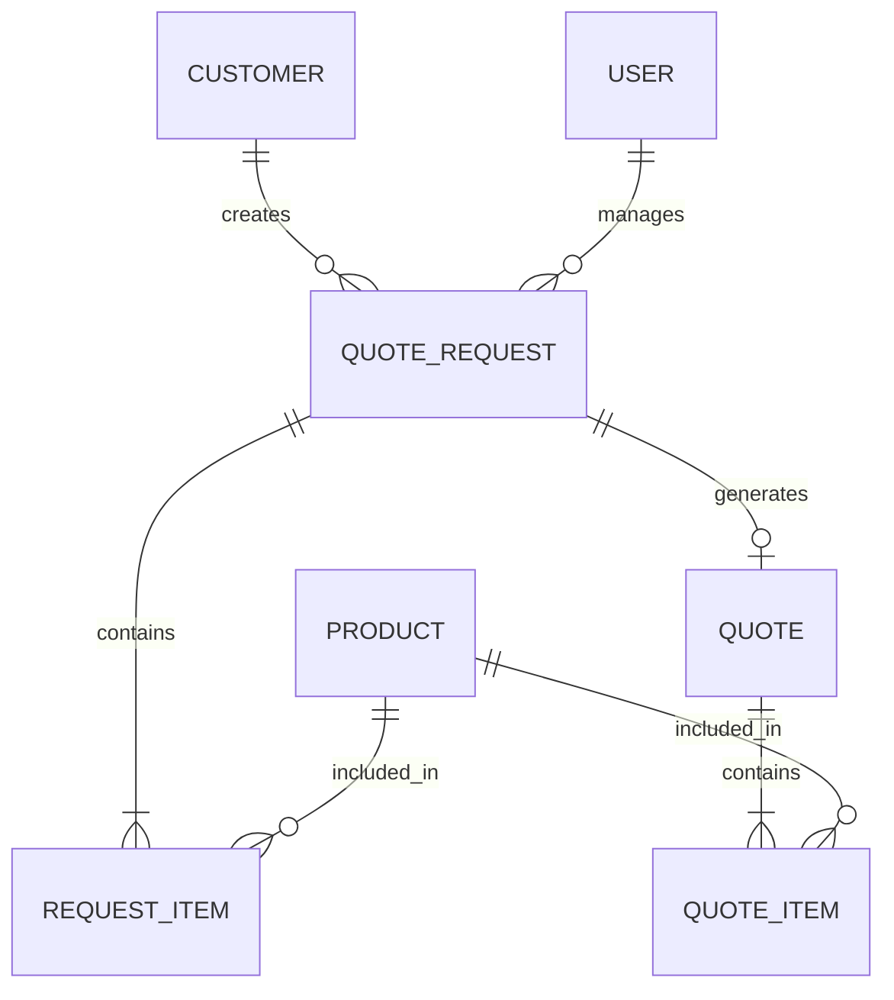

# Veri Modeli ve ERD

## Amaç

B2B teklif talep sisteminde teklif sürecinin yönetilebilmesi için gerekli temel veri varlıkları ve bu varlıklar arasındaki ilişkiler belirlenmiştir.

## Temel Varlıklar

### Müşteri

Kurumsal müşteriye ait bilgileri tutar.

* müşteri_id
* firma_adı
* yetkili_adı
* e_posta
* telefon

### Teklif Talebi

Müşterinin oluşturduğu teklif talebini tutar.

* talep_id
* müşteri_id
* talep_tarihi
* durum
* açıklama

### Talep Kalemi

Teklif talebinde istenen ürün veya hizmet bilgilerini tutar.

* talep_kalemi_id
* talep_id
* ürün_id
* miktar

### Ürün

Teklif talebinde veya teklifte yer alan ürün/hizmet bilgilerini tutar.

* ürün_id
* ürün_adı
* birim

### Teklif

Teklif talebine karşılık satış ekibi tarafından hazırlanan teklifi tutar.

* teklif_id
* talep_id
* teklif_tarihi
* geçerlilik_tarihi
* toplam_tutar
* durum

### Teklif Kalemi

Teklif içerisindeki ürün, miktar ve fiyat bilgilerini tutar.

* teklif_kalemi_id
* teklif_id
* ürün_id
* miktar
* birim_fiyat
* toplam_tutar

### Kullanıcı

Sistemi kullanan kullanıcıların bilgilerini tutar.

* kullanıcı_id
* ad_soyad
* e_posta
* rol

## Varlık İlişkileri

## İlişki Açıklamaları

* Bir müşteri birden fazla teklif talebi oluşturabilir.
* Bir teklif talebi bir veya daha fazla talep kalemi içerebilir.
* Bir ürün birden fazla teklif talebinde yer alabilir.
* Bir teklif talebi en fazla bir teklif ile ilişkilidir.
* Bir teklif bir veya daha fazla teklif kalemi içerebilir.
* Bir ürün birden fazla teklifte yer alabilir.
* Bir kullanıcı birden fazla teklif talebini yönetebilir.
