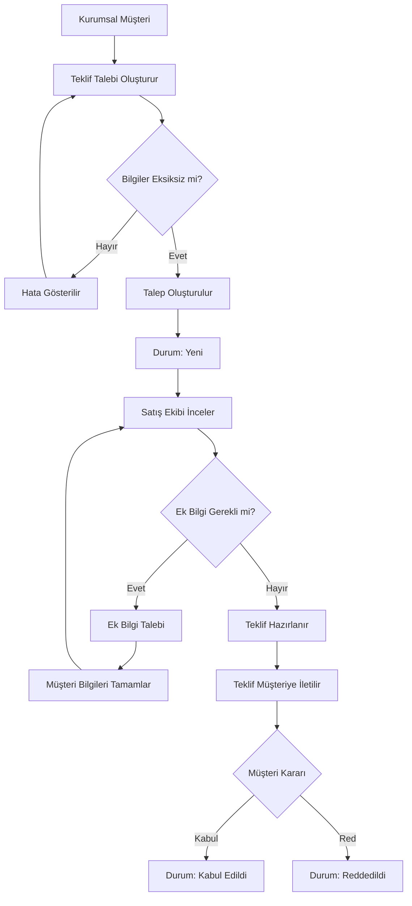

# B2B Quote Request System

B2B müşterilerin teklif taleplerini dijital ortamda oluşturmasını, satış ekibinin bu talepleri yönetmesini ve hazırlanan tekliflerin müşteriye iletilmesini amaçlayan örnek bir Business Analysis projesidir.

Proje kapsamında bir teklif talep süreci baştan sona analiz edilmiş; iş gereksinimleri, fonksiyonel gereksinimler, iş kuralları, kullanıcı hikâyeleri, süreç akışları, veri modeli, SQL sorguları, test senaryoları, UAT ve gereksinim izlenebilirliği dokümante edilmiştir.

---

## Proje Amacı

Mevcut süreçte teklif taleplerinin e-posta veya telefon üzerinden alınması;

* Eksik bilgi alınmasına
* Taleplerin farklı kanallarda takip edilmesine
* Süreç takibinin zorlaşmasına
* İşlem geçmişinin dağınık olmasına
* Satış ekibinin talepleri manuel olarak takip etmesine

neden olmaktadır.

Bu proje ile teklif talep sürecinin standartlaştırılması ve merkezi bir sistem üzerinden yönetilmesi hedeflenmiştir.

---

## Proje Kapsamı

### Kapsama Dahil

* Kurumsal müşteri bilgilerinin alınması
* Teklif talebi oluşturma
* Zorunlu alan kontrolleri
* Talep numarası oluşturma
* Talep durumlarının yönetilmesi
* Ek bilgi talep süreci
* Teklif oluşturma
* Teklifin müşteriye iletilmesi
* Müşteri kabul/reddetme işlemleri
* Rol bazlı yetkilendirme
* İşlem geçmişinin tutulması

### Kapsam Dışı

* Ödeme işlemleri
* Sipariş yönetimi
* Kargo ve teslimat
* Muhasebe işlemleri

---

## Kullanıcı Rolleri

| Rol               | Sorumluluk                                                                   |
| ----------------- | ---------------------------------------------------------------------------- |
| Kurumsal Müşteri  | Teklif talebi oluşturur, taleplerini takip eder ve teklifleri kabul/reddeder |
| Satış Ekibi       | Talepleri inceler, ek bilgi ister ve teklif hazırlar                         |
| Satış Yöneticisi  | Süreci takip eder ve satış taleplerini yönetir                               |
| Sistem Yöneticisi | Kullanıcı, rol ve yetkilendirmeleri yönetir                                  |

---

## Business Analysis Çalışmaları

### 01 - Business Analysis

* Problem Definition
* Stakeholders
* Business Requirements
* Functional Requirements

### 02 - Requirements

* Business Rules
* User Stories
* Acceptance Criteria

### 03 - Process Analysis

* AS-IS Process
* TO-BE Process
* Process Flow

### 04 - Data Analysis

* Entity Relationship Diagram (ERD)
* SQL Queries

### 05 - Testing

* Test Scenarios
* User Acceptance Testing (UAT)

### 06 - Traceability

* Requirements Traceability Matrix (RTM)

---

## Süreç Akışı

Temel teklif süreci aşağıdaki şekilde ilerlemektedir:



---

## Veri Modeli

Projede aşağıdaki temel veri yapıları ele alınmıştır:

* CUSTOMER
* QUOTE_REQUEST
* REQUEST_ITEM
* PRODUCT
* QUOTE
* QUOTE_ITEM
* USER

Bu yapılar arasındaki ilişkiler `04-data-analysis/erd.md` dosyasında gösterilmiştir.

---

## SQL Çalışmaları

Projede örnek SQL sorguları ile aşağıdaki veri analizleri gerçekleştirilmiştir:

* Teklif taleplerinin müşteri bilgileriyle birlikte listelenmesi
* Belirli durumdaki taleplerin filtrelenmesi
* Talep edilen ürünlerin görüntülenmesi
* Tekliflerin müşteri bilgileriyle birlikte listelenmesi
* Teklif toplamlarının hesaplanması
* Kabul edilmiş tekliflerin listelenmesi
* Durumlara göre talep sayılarının hesaplanması
* En çok talep edilen ürünlerin belirlenmesi

---

## Test ve UAT

Sistem için fonksiyonel test senaryoları ve kullanıcı kabul testleri hazırlanmıştır.

Test kapsamında özellikle:

* Form validasyonları
* Teklif talebi oluşturma
* Talep durumları
* Ek bilgi süreci
* Teklif oluşturma
* Toplam tutar hesaplama
* Müşteri kabul/reddetme
* Yetkilendirme
* İşlem geçmişi

kontrol edilmiştir.

---

## Gereksinim İzlenebilirliği

Projede gereksinimlerin uçtan uca takip edilebilmesi için Requirements Traceability Matrix (RTM) hazırlanmıştır.

İzlenen yapı:

**Business Requirement → Functional Requirement → User Story → Acceptance Criteria → Test Case → UAT**

Bu yapı sayesinde gereksinimlerin analizden test aşamasına kadar izlenebilir olması amaçlanmıştır.

---

## Kullanılan Yaklaşımlar

* Business Analysis
* Requirements Analysis
* Stakeholder Analysis
* Business Rules
* User Stories
* Acceptance Criteria
* AS-IS / TO-BE Analysis
* Process Flow
* ERD
* SQL
* Functional Testing
* UAT
* Requirements Traceability Matrix

---

## Proje Yapısı

```text
b2b-quote-request-system/
│
├── README.md
│
├── 01-business-analysis/
│   ├── problem-definition.md
│   ├── stakeholders.md
│   ├── business-requirements.md
│   └── functional-requirements.md
│
├── 02-requirements/
│   ├── business-rules.md
│   ├── user-stories.md
│   └── acceptance-criteria.md
│
├── 03-process-analysis/
│   ├── as-is-process.md
│   ├── to-be-process.md
│   └── process-flow.md
│
├── 04-data-analysis/
│   ├── erd.md
│   └── sql-queries.sql
│
├── 05-testing/
│   ├── test-scenarios.md
│   └── uat.md
│
└── 06-traceability/
    └── requirements-traceability-matrix.md
```

---

## Proje Notu

Bu proje, gerçek bir şirket veya müşteri verisi kullanılmadan, Business Analyst perspektifiyle hazırlanmış örnek bir B2B teklif talep süreci analizidir.
